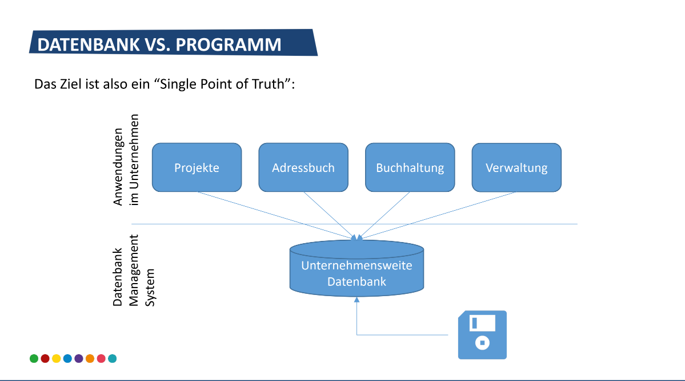
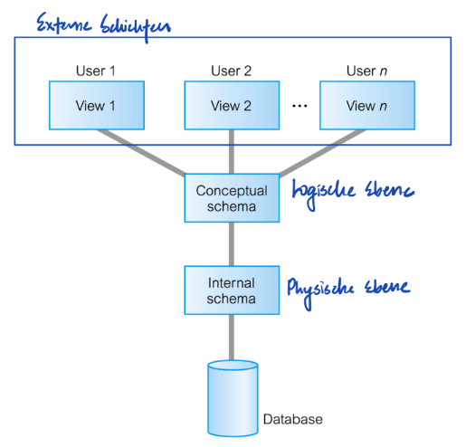
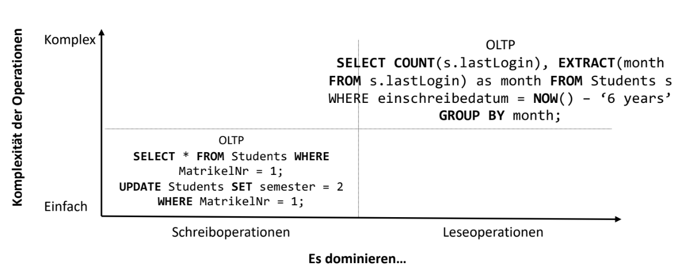
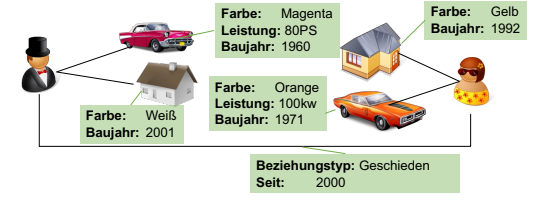
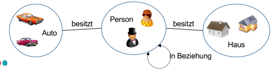
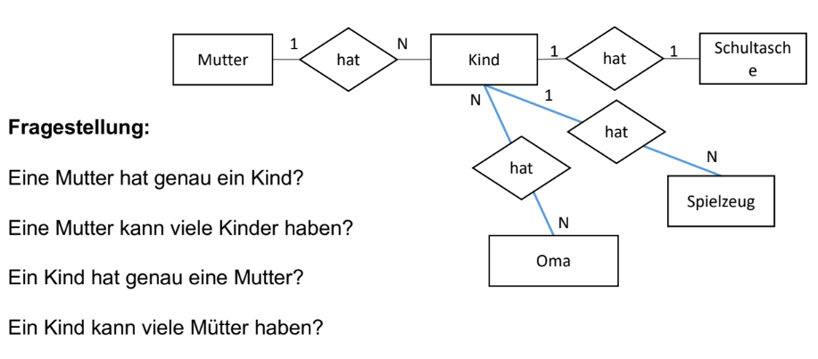
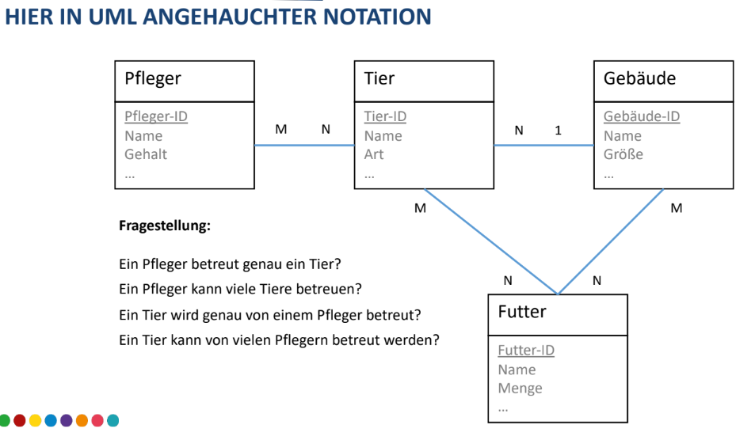
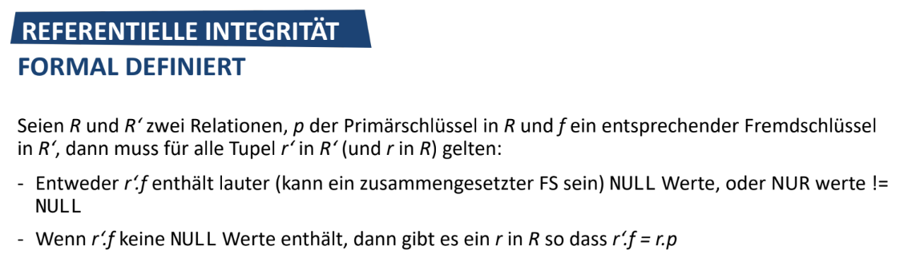
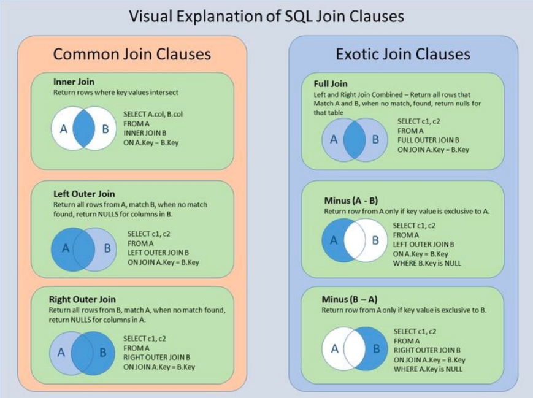

## **01 Einfuehrung**

1. **Daten — Information — Wissen**

   - `Daten`
     - als Produktionsfaktor
     - als Entscheidungsgrundlage
     - mit Qualitaetsanspruch
     - als Investitionsbedarf

1. **Was ist eine Datenbank?**

   - Informationsspeicher, in dem grosse Datenmengen geordnet `erfasst, persistiert`, und `geaendert` werden koennen
   - Mit einer Datenbank erreicht man die `Unabhaengigkeit der Anwenderprogramme von der Datenspecherung`:
     - Wo ist etwas
     - Wie gespeichert
     - Wie sortiert
     - Was passiert bei Aenderungen
   - Deklarativ im Vergleich zu prozedural
     - `Deklarativ:` You describe what you want, not how to get it
     - `Prozedural:` You define how to do something

1. **Datenbank-Management System (DBMS)**

   - Software, die einem Benutzer `Zugriff auf diese Daten` gibt, ihm erlaub sie zu `durchsuchen` oder sie zu `aendern`

1. **Warum schreibe ich das Persistenz Layer nicht einfach selbst?**

   - To understand the question better: Questioning the wisdom of creating a custom solution for data persistence when standard databases could serve the purpose. Outlines the challenges arise from custom-built persistence layer.

     

   - By having a centralized database, the organization can ensure that each department is `looking at the same data`, which helps in `decision-making, reduces data redundancy`, and ensures that everyone has the most current and accurate information.

1. **Nachteile von Datenbanken**

   - **`Komplexitaet`**: Die Verwaltung von Datenbanken kann aufgrund der Notwendigkeit, Datenbanksprachen, -design und -architektur zu verstehen, komplex sein, was spezielle Faehigkeiten erfordert.
   - **`Kosten Software & Hardware`**: Datenbanken koennen teuer in der Implementierung und Wartung sein, z.B. Kosten fuer Softwarelizenzen, Hardware und Personal anfallen.
   - **`Performance`**: Grosse Datenmengen und komplexe Abfragen koennen zu Leistungsproblemen fuehren, die Geschwindigkeit und Effizienz der Datenbankoperationen beeintraechtigen (compromise).
   - **`Schaden durch Ausfall einer Zentralen Komponente`**: Der Ausfall einer zentralen Komponente in einem Datenbanksystem kann zu erheblichen Stoerungen und potenziellem Datenverlust fuehren.

1. **Vorteile von Datenbanken**
   - **`Redundanzen vermieden / Geteilte Datenhaltung`**: Unnoetige Datenverdopplungen zu vermeiden und sorgen fuer eine effiziente Datenverwaltung in verschiedenen Teilen einer Organisation.
   - **`Konsistenzverwaltung`**: Datenbanken gewaehrleisten die Datenkonsistenz durch Integritaetsbeschraenkungen und stellen zuverlaessige und genaue Informationen bereit.
   - **`Zugriffskontrolle`**: Datenbankne bieten robuste Zugriffskontrollmechanismen, um Daten gegen unbefugten (unauthorized) Zugriff und Aenderungen zu sichern.
   - **`Standardbasiertes Vorgehen`**: Datenbanken verwenden feste Regeln, um die Daten richtig und einheitlich zu verwalten.
   - **`Konstenersparnis durch standardisierte Datenhaltung`**: Einheitliche Methoden in Datenbanken sparen Geld, weil Dinge wie Datensicherungen und Cloud-Server einfacher sind.

## **02 Grundlagen**

1. **General Guidelines for Database Management and Design**

   1. **`Integration`**: Einheitliche, redundanzfreie Datenverwaltung
   1. **`Operation`**: Speichern, Aendern, Such und Suchen/Lesen
   1. **`Katalog`**: Zugriffe auf Datenbeschreibungen in Data Dictionary
   1. **`Benutzersichten`**: Festlegung benutzerspezifischer Sichten auf die Relationen
   1. **`Integritaetssicherung`**: Korrektheit des Datenbankinhalts
   1. **`Datenschutz`**: Verhinderungen unautorisierter Zugriffe
   1. **`Transaktionen`**: DB-Operationen als logische Einheit definierbar
   1. **`Synchronisation`**: parallele Transaktionen koordinieren
   1. **`Datensicherung`**: Wiederherstellung von Daten nach Systemfehlern

1. **Codd'sche Regeln**

   1. **`Rule 0 - Foundation rule`**: Das system wird ausschliesslich durch `relationale Operationen` bedient
   1. **`Rule 1 - Information rule`**: Alle `Informationen` der DB werden `auf der losigchen Ebene in Tabellen gespeichert` (As values in a table)
   1. **`Rule 2 - Guaranteed access rule`**: Jedes `Tupel` der DB kann `durch Table und PK addressiert werden`
      ```
      `SELECT * FROM Users WHERE UserID = 123;` where `Users` is the table name and `UserID` is the primary key column that uniquely identifies each other
      ```
   1. **`Rule 3 - Systematic treatment of null values`**: _NULL_ Werte stellen fehlende sowohl `fehlende als auch unbekannte werte` dar
   1. **`Rule 4 - Dynamic online catalog`**: Die Beschreibung der DB ist auch eine Tabelle (same way as ordinary data)
   1. **`Rule 5 - Comprehensive data sublanguage rule`**: Es gibt eine Sprache (z.B. SQL - Structured Query Language) die folgendes beinhaltet:

      - Definition von Daten, Views (Perspectives), Berechtigungen, Transaktionen, Integritaetsbestimmungen, Operationen zur Datenmanipulation

      ```
      Data Definition: `CREATE TABLE students (id INT, name VARCHAR(100));`
      View Definition: `CREATE VIEW graduate_students AS SELECT * FROM students WHERE degree = 'MS';`
      ```

   1. **`Rule 6 - View updating rule`**: Jede theoretisch updatebare view ist auch updatebar
   1. **`Rule 7 - Possible for high-level insert, update, and delete`**: Insert / Update und Delete sind transaktionsbasiert
   1. **`Rule 8 - Physical data independence`**: Schichtenmodell, Aenderungen am physikalischen Datenlayout beeinflussen Applikationen und die logsiche Ebene nicht

      ```
      If a database is moved from a traditional hard drive to an SSD, the applications that query the database should continue to function without any changes
      ```

   1. **`Rule 9 - Logical data independence`**: Applikationen werden nicht von Aenderungen am logischen Datenlayout beeintraechtigt, wenn die Aenderungen informationserhaltend (information preserving) sind und die Basistabellen nicht veraendern

      ```
      If you decide to split a table into two tables for better organization, as long as the application can still find all the information it needs, you don't need to change the application
      ```

   1. **`Rule 10 - Integrity independence`**: Auch Integritaetsbedingungen sind nicht Herstellerspezifisch und werden im Schema gespeichert
   1. **`Rule 11 - Distribution independence`**: Ob die Datenbank verteilt oder Single-Node ist darf keinen Unterschied fuer die Anwendungsprogramme machen

      ```
      Whether the database runs on a single server or is spread across multiple servers in different geographic locations, an application querying the database for customer data uses the same SQL command without needing to know the physical location of the data
      ```

   1. **`Rule 12 - Nonsubversion rule`**: Eine "low-level" Api darf diese Punkte nicht unterwandern (This means that one shouldn't be able to use some backdoor ways to skip the rules of the database when you add, change, or remove data. There should be consistent rules that always apply, no matter how you interact with the data)

      ```
      If there's a rule that every student record must have a student ID, one shouldn't be able to add a new student without an ID, even if one is using some advanced programming techniques. All opeartions should respect this rule
      ```

1. **Was ist eine relationale Datenbank?**
   Datenbank, die Daten in `Tabellen mit Zeilen und Spalten organisiert`, wobei `jede Zeile einen eindeutigen Datensatz` repraesentiert und `jede Spalte ein Feld oder Attribut` der Daten darstellt

1. **Was ist ein DBMS?**

   - Database Management System
   - In dem koennen `Datenbanken angelegt` und `verwaltet` werden
   - `Erfassung, Speicherung, Pflege` von Daten in DB
   - z.B. mysql, postgres
   - Der umfasst die `Gesamtheit an Programmen`, die zum `Aufbau`, zur `Nutzung` und zur `Verwaltung` von DBen notwendig ist

1. **Features eines DBMS**

   - CRUD — `Create Read Update Delete` Operationen
   - Catalog (Directory / Index that holds information about the database itself. I.e. Metadata)
   - Schichten Architektur
   - **`ACID`**
     - Transaktionen
     - Nebenlaeufigkeitskontrolle
     - Konsistenz
     - Datensicherheit (Recovery)
   - Access Control

1. **Definitionen**

   - **`Konsistenz`**: Eine Datenbank heisst in sich konsistent, wenn alle `gespeicherten Daten untereinander widerspruchsfrei sind`
   - **`Redundanz`**: Daten sind redundant gespeichert, wenn sie `mehrfach` in einer Datenbank abgespeichert sind, also ueberfluessige Kopien existieren

1. **Transaktionen**

   - A transaction is an `indivisible logical unit of work in a DBMS`, allowing you to `represent multiple operations as a single step`
     - Eine Operation besteht meist aus kleineren Operationen
     - Es gibt Operationen die zusammen ablaufen muessen
     - "Alles oder nichts" Semantik
     - Mehr Parallelitaet mehr Probleme => Isolation

1. **ACID**  
   Dinge die eine Datenbank-Transaktion Gewaerleisten muss

   - **`[A]tomar`**: Eine Transaktion muss als eine unteilbare Einheit betrachtet werden. Wenn irgendein Teil der Transaktion fehlschlägt, muss die gesamte Transaktion fehlschlagen und der Zustand der Datenbank unverändert bleiben. `Alles oder nichts (COMMIT oder ABORT)`
   - **`[(C)K]onsistent`**: Konsistenz stellt sicher, dass eine Transaktion die Datenbank von einem gültigen Zustand in einen anderen gültigen Zustand überführt. Sie darf keine vordefinierten Regeln, Integritätsbedingungen oder Situationen verletzen, die die Datenbank in einem halbfertigen Zustand hinterlassen würden. `Die Datenbank ist vor und nach der Transaktion konsistent`
   - **`[I]soliert`**: Die Isolationseigenschaft stellt sicher, dass Transaktionen sicher und unabhängig voneinander verarbeitet werden, ohne Interferenzen von anderen gleichzeitigen Transaktionen
   - **`[D]auerhaft`**: Dauerhaftigkeit garantiert, dass einmal festgeschriebene Transaktionen auch im Falle eines Systemausfalls bestehen bleiben. Das bedeutet, dass die durch die `Transaktion vorgenommenen Aenderungen dauerhaft in der Datenbank gespeichert werden`

1. **Problem mit der Isolation**  
   **FYI: Written vs Committed**

   - Written: Data sent to the database and stored in some form. Doesn't necessarily mean that the change is permanent or visible to other transactions. I.e. temporary data where it has not yet been finalized. This is often held in a transaction log or buffer and can be rolled back if the transaction doesn't complete successfully
   - Committed: All the operations within the transaction have been successfully completed, and the changes are now permanent

   **READING**

   - **`Dirty Read`**: Wert(e) lesen, die evtl. Einem _ROLLBACK_ zum Opfer fallen

     ```
     Imagine you're reading an online article that is being edited live. You see a paragraph about a celebrity. Suddenly, the paragraph disappears because the editor decided not to publish it. You have just experienced a 'dirty read' of the uncommitted edit
     ```

   - **`Non-Repeatable Read`**: Erneutes Lesen bringt unterschiedliche Werte

     ```
     You check the price of an item in an online store and decide to buy it after 10 minutes. When you return to the page to make the purchase, you find the price has increased. This price change is a 'non-repeatable read'
     ```

   - **`Phantom Read`**: Erneutes Lesen einer range bringt neue Werte

     ```
     You search for books by a specific author in a library database and find 10 books. When you search again a minute later, you find 11 books because a new book was just returned and added to the database
     creating a 'phantom read'
     ```

   <br></br>
   <br></br>
   <br></br>
   <br></br>

   **WRITING**

   - **`Lost Update`**: Eine zweite Transaktion ueberschreibt mein Ergebnis

     ```
     Two admins are updating the price of the same product at the same time. Admin A changes the price to $20, and almost simultaneously, Admin B changes it to $25. If Admin A's update is lost, only the $25 update is saved, resulting in a 'lost update'
     ```

   - **`Dirty Write`**: Nach einem _dirty read_ wird das Ergebnis auf dieser Basis geschrieben

     ```
     Suppose two people are collaboratively editing an online document. One person makes changes to a paragraph but hasn't saved them yet. The other person, not seeing these changes, overwrites the entire paragraph
     ```

   - ❗❗❗ **`Write skew`**: Unguenstige Verkettung zweier Transaktionen die an sich unabhaengig sind

     ```
     1. Initial State: Both Dr. A and Dr. B start a transaction to update their schedules at the same time. The system's rule is checked, and it sees that both doctors are scheduled, so it’s okay if one of them changes their shift.

     2. Transactions Execution:
     - Dr. A's transaction changes her shift to leave early, which by itself is fine because Dr. B is still there.
     - Concurrently, Dr. B's transaction changes his shift to start late, which by itself is also fine because Dr. A's original shift covers the period.

     3. Commit Point: Both transactions pass the checks individually and are committed to the database.

     4. Resulting Problem: Now there is a period when neither Dr. A nor Dr. B is on duty, violating the business rule that there must always be one doctor present.
     ```

   > `Weniger Isolation` = Mehr gleichzeitige Zugriffe auf die selben Daten, aber auch `mehr Probleme`  
   > `Mehr Isolation` = Weniger gleichzeitige Zugriffe, `mehr Resourcenverbrauch, blockierende Abfragen`

   <br></br>
   <br></br>

1. **Isolationslevel — Vom niedrigsten zum hoechsten**

   - **`Read Uncommitted`**: `Isolation faktisch ausgeschalten.` Alles wird erschienen, z.B. Zwischenergebnisse. Transactions are allowed to read uncommitted changes

     ```
     - Alle genannten Probleme
     - Jeder Sitzplatz, der im Warenkorb von anderen Nutzern liegt wird als gebucht angezeigt
     ```

   - **`Read Committed`**: `Nur Werte von erfolgreichen Transaktionen werden angezeigt.` Aber nicht immer die selben Werte. Transaction can only read committed data from other transaction

     ```
     - Phantom read + non repeatable read problem
     - Es wird die zum Zeitpunkt der Anfrage aktuelle Zahl von Sitzplaetzen angezeigt. Die kann sicher aber in Ihrer Session beim neu laden aendern
     ```

   - **`Repeatable Read`**: Die angezeigten Werte werden beim naechsten mal wieder so angezeigt. Es koennen aber neue dazu kommen. If a value is read, it cannot be changed by other transactions until current transaction is complete

     ```
     Phantom Read verbleibt als Problem
     ```

   - **`Serializable`**: Eine ressourcenintensivste Isolation. `Strikte Aufloesung der Abhaengigkeiten in eine Reihenfolge.` (Strict resolution of dependencies into an order) Es scheint, als ob Sie ganz allein auf der Datenbank arbeiten. `Fuer die Dauer der Transaktion gibt es auch keine neuen Werte`

     ```
     Preis aller Sitzplaetze / Anzahl der Sitzplaetze. Beides sollte zum Zeitpunkt der Berechnung fix sein
     ```

1. **Aufbau DBMS**  
   

   - **`Externe Sichten`**: `Was` sieht ein einzelner Benutzer?

     ```
     Name, Matrikelnr. Fach...
     ```

   - **`Konzeptionelle Sicht / Logische Ebene`**: `Wie` sind die `Daten strukturiert`?

     ```
     Schema > Tabelle Student (Matrikelnr, Name, Address...)
     ```

   - **`Interne Sicht / Physische Ebene`**: `Wie` sind die `Daten gespeichert`?

     ```
     Speicherung in einer Datei der Datenbank namens std01.bin, 100 GB groß, Indizes auf Tabellen...
     ```

   ❗❗❗ **Datenunabhaengigkeit**. Kein "Neuschreiben" der Applikation bei Aenderungen in den darunter liegenden Layern. That means that system's ability to `change the database schema at one level of a database system without having to change the schema at the next higher level`

   - E.g. Changes in the physical level (how data is stored, like changing file structures or switching to new storage devices) do not necessitate rewriting application programs that interact with the data at the conceptual or external levels
   - **`Logical Data Independence`**: The capacity to change the conceptual schema without having to alter external schemas or application programs. Users' views of the data should not be affected by changes to the logical structure of the data
   - **`Physical Data Independence`**: The capacity to change the internal schema without having to alter the conceptual schema or application programs. For instance, changes to file structures, storage devices, or indices should not require changes to the logical structure of the database

1. **Systemkatalog / Schema => Metadata**

   - Struktur der Daten, nur so strukturierte Daten koennen gespeichert werden
     - Tabellenname und Attribute (mit Datentypen) sind aufgelistet
     - Zugriffsrechte
     - Constraints / Integritaetsbedingungen
     - Statistiken

1. **Online Transaction Processing (OLTP)**

   - Einfach und Schreiboperationen
   - Sichere Verwaltung von sehr vielen kleinen Datensaetzen, die staendig geschrieben / gelesen werden

1. **Online Analytics Processing (OLAP)**

   - Komplex und Leseoperationen
   - (Scheinbar) zufaelliger Zugriff (random access) durch einen Analysten auf sehr sehr viele, grosse Datenmengen mit komplexen Anfragen

   

## **04 Modellierung**

1. **Was ist ein Modell?**  
   Auf der Basis von Funktions-, Struktur- oder Verhaltensähnlichkeiten bzw. -analogien zu einem Original werden `Modelle zum Zwecke speziell solcher Problemlösungen benutzt`, deren Durchführung am Original nicht möglich oder zu aufwendig wäre  
   On the basis of functional, structural, or behavioral similarities or analogies to an original, models are used for the purpose of solving problems specifically, the implementation of which would not be possible or too costly on the original

   - Ein Modell ist `ein fuer einen bestimmten Anwendungszweck reduziertes Abbild`. Sie legen u.a. fest:
     - Welche Objektarten
     - Attribute
     - Gueltige Typen und Wertebereiche
     - Integritaetsbedingungen: Integrity constraints are rules that data must adhere to in order to maintain the correctness, consistency and validity of the data in a database

1. **Data Definition Language (DDL)**

   - Used to create and modify the structure of database objects like tables
     - _CREATE_
     - _ALTER_
     - _DROP_
     - _..._

1. **Data Manipulation Langauge (DML)**

   - Used for inserting, updating, deleting and querying data in the database objects that DDL has defined
     - _INSERT_
     - _UPDATE_
     - _DELETE_
     - _SELECT_

1. **Entitaet, Entitaetstyp, Relationen und Attribute**

   - Eine `Entitaet` ist ein `Objekt aus der realen` oder konzeptionellen Welt
   - Entitaeten koennen untereinander in Beziehung stehen
   - Entitaeten und Beziehung koennen `durch Attribtute (Eigenschaften) beschrieben` werden  
     
   - Entitaeten mit `gleichen Attributen, aber unterschiedlichen Attributauspraegungen (attribute values) koennen zu Entitaetstypen kombiniert` werden  
     

1. **Domaene**  
   Eine Domaene in einer Datenbank legt die Menge an gueltigen Werten fest, die ein Attribut annehmen kann, und dient dazu, die Integritaet und Korrektheit der Daten zu gewaehrleisten

1. **Relation**  
   **Definition**: Eine Relation ist eine `Tabelle` bestehend `aus einem Kopf und einem Rumpf` (body) mit den folgenden Eigenschaften:

   1. Es gibt `keine doppelten Tupel`
   1. `Tupel` und `Attribute` sind `nicht geordnet` (ordered) => Daher brauchen wir Primary Keys!
   1. Alle Attribute sind `atomar`
      - _Nicht das Atomar des ACID Paradigmas!_
      - Nur ein Wert pro Attribut
      - Keine Listen, Aufzaehlungen (list)
   1. Ein Attribut nimmt Werte seiner Domaene an
   1. Attribute haben unterschiedliche Namen

1. **Schluessel**  
   **Primaerschluessel (PK)**

   - Besteht aus einem oder mehreren Attribut(en) einer Relation
   - Die Menge dieser Attribute muss minimal sein
     - Nicht jedes Attribut wahllos unterstreichen
     - Jede denkbare Attributmenge eindeutig identifizieren
   - Die jedes Tupel eindeutig identifiziert

   **Sekundaerschluessel / Fremdschluessel (FK)**

   - Definiert Beziehungen zwischen Tabellen
   - Gewaehrleistet die Zuordnung von Datensaetzen "fremder" Tabellen
   - Gegenstueck zum PK
   - Attribut in anderer Tabelle PK => FK in dieser Tabelle

   ```
   The primary key is essential for uniquely identifying each record in a table and must be unique and not null. The foreign key is used to establish and enforce referential integrity between tables. For example, in a database with a table for Students and a table for Enrollments, the StudentID would be the primary key in the Students table and a foreign key in the Enrollments table, linking each enrollment entry to a specific student
   ```

1. **Primary Keys**  
   **Surrogate Key**

   - Nicht aus den vorhandenen Daten abgeleitet: Not based on any of the actual data within the rows
   - Durch die Datenbank generiert: Auto-incremented number created by database system itself
   - `Kann die Eindeutigkeit eines Datensatzes nicht vollstaendig garantieren`: Unique, but doesn't inherently ensure the real-world uniqueness of the data it represents
   - `Aenderungen am Datensatz erzeugen keine Aenderung des Schluessels`: Independent of the actual data, so altering the data in a table does not require changes to the surrogate key

   **Natural / Domain Key**

   - `Aus den Attributen des Datensatzes` geformt: like an email address or a social security number
   - Logische Beziehung zum Datensatz
   - Stellt die "uniqueness" eines Datensatzes "by design" sicher
   - Sie haben den Datensatz wohl "zur Hand": The key is readily available as part of the existing data
   - `Leidet unter Aenderungen der Attribute aus denen er gebildet wird`

1. **Beziehungen**  
   
   

1. **Integritaet und Konsistenz in der DB**

   - Eine Datenbasis ist konsistent, wenn Daten untereinander widerspruchsfrei abgelegt sind
   - Eine Datenbank ist integer, wenn die Daten akkurat und konsistent sind
     - **`Entity integrity`** — Es muss einen Primary Key geben. Dieser ist unique pro Tabelle und nicht `NULL`
     - **`Domain integrity`** — Domaenen verhindern die Eingabe von inakkuraten Daten
     - **`Referential integrity`** — Hier geht es um Foreign Keys, es sorgt fuer die Korrektheit und Konsistenz der Beziehungen zwischen verschiedenen Tabellen

1. **Referential Integrity**  
   

   - Any foreign key field (f) in one table (R') must match the primary key (p) in the related table (R)
   - If there's a value in the foreign key column, it must exist in the primary key column of the table it references

1. **Weitere ER Notationen**  
   Refer to slide
   - MC-Notation (Modified Chen)
   - Martin-Notation (Kraehenfuss - Crow's foot)
   - (min, max) Notation

## **05 Implementierung**

1. **Transformation zum relationalen Modell**  
   Steps:

   1. Umwandlung starke Entitaetstypen
   1. Umwandlung schwache Entitaetstypen (erstmal ohne PK)
   1. Umwandlung 1:N Beziehungen
   1. Umwandlung M:N Beziehungen  
      4.1. Umwandlung hoeherwertige Beziehungen
   1. Umwandlung existenzabhaengigen 1:1 Beziehungen

1. **Anomalien in der Datenbank**

   1. **`Update-Anomalie`**: Daten sind redundant gespeichert, d.h. Änderungen müssen mehrfach durchgeführt werden. z.B. Kunde 10 zieht um
      - This occurs when the same piece of information is duplicated in multiple rows of a database. If any of this information needs to be updated, it must be changed in multiple places, which increases the risk of errors and inconsistencies. For instance, if a customer's address is stored in multiple records because they have multiple orders, and the customer moves, the address must be updated for each order record instead of just once for the customer
   1. **`Einfuege-Anomalie`**: Die Attribute zweier Entitätstypen werden vermischt. Deshalb treten Probleme auf, wenn man Daten eintragen will, die nur zu einen Entitätstyp gehören. z.B. Kunden ohne Order anlegen
      - An insertion anomaly happens when certain data cannot be inserted into the database without the presence of other unrelated data. In a database where customer and order information is stored in the same table, you might not be able to add a new customer until they place an order, which should not be a requirement
   1. **`Loesch-Anomalie`**: Wenn ein Tupel von miteinander vermischten Entitätstypen gelöscht wird, kann es zu einem unbeabsichtigten Verlust von Daten kommen. z.B. alle Bestellungen löschen => Kundendaten verlieren
      - A deletion anomaly occurs when the removal of a single piece of data results in unintended loss of additional data that should not necessarily be deleted. For example, if orders and customers are stored in the same table, deleting all orders for a particular customer might unintentionally remove the customer's information from the database as well

1. **Normalformen**  
   Refer to slide
   1. **`1. NF`**: Jedes Attribut ist vom `Primaerschluessel funktional abhaengig und Atomar`  
      ▶️ Durchsuchbarkeit, Sortierung moeglich
   1. **`2. NF`**: Relation ist `in 1. NF` & `alle Nicht-Schluessel Attribute voll funktional vom Schluessel abhaengig`  
      ▶️ Keine Mischung von Konzepten
   1. **`3. NF`**: Relation ist `in 2. NF` & es gibt `keine transitiven Abhaengigkeiten in der Menge der nicht-Schluesselattribute`  
      ▶️ Redundanzvermeidung

## **06 Relationenalgebra**

1. **Mengenoperationen**

   - Vereinigung
   - Durchschnitt (Intersect)
   - Differenz

   **Voraussetzung: Vereinigungsverträglichkeit**

   - Anzahl der Attribute stimmt überein (n = m)
   - Alle Domänen sind identisch (D(Ai) = D(Bi))
   - Alle Attributbezeichner sind gleich (Ai = Bi)

1. **Joins**  
   

## **SQL**

1. **Data Definition Language DDL**

   - Relationen erzeugen, aendern und loeschen
   - Sichten erzeugen und loeschen
   - Integritaetschecks, Invarianten, Trigger, Sequenzen
   - Zugriffsrechte und Zugriffsschutz

1. **Datentypen**  
   Refer to slide

1. **Zugriffsrechte**  
   Refer to slide

1.
