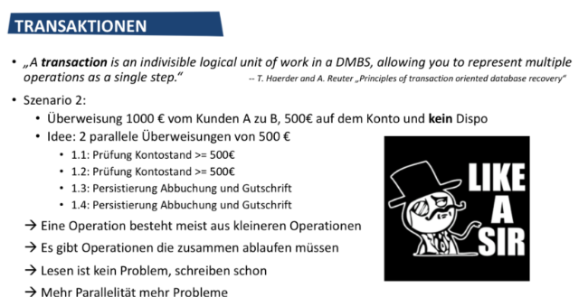

## **TABLE OF CONTENTS**

1. [Einfuehrung: Warum verwenden wir Datenbanken?](#einfuehrung-warum-verwenden-wir-datenbanken)

## **Einfuehrung: Warum verwenden wir Datenbanken?**

1. **Was ist eine (relationale) Datenbank, was ist ein DBMS?**

   - **`Datenbank`**: Eine Datenbank ist ein Informationsspeicher, in dem grosse Datenmengen geordnet erfasst, persistiert, und geaendert werden koennen.
   - Mit einer Datenbank erreicht man die Unabhaengigkeit der Anwenderprogramme von der Datenspeicherung: `Wo ist etwas, wie gespeichert` und `wie sortiert` und `was passiert bei Aenderungen`.
   - **`DBMS`**: Eine Software, die einem Benutzer Zugriff auf diese Daten gibt, ihm erlaub sie zu durchsuchen oder sie zu aendern.

1. **Features: Transaktionen und ACID, Isolationslevel**

   - **Transaktionen**

     - An indivisible logical unit of work in a DBMS, allowing you to represent multiple operations as a single step.
     - `"Alles oder nichts"` Semantik
     - Beispiel:  
       

   - **ACID**

     Dinge die eine Datenbank-Transaktion Gewaerleisten muss

     - **`[A]tomar`**: Eine Transaktion muss als eine unteilbare Einheit betrachtet werden. Wenn irgendein Teil der Transaktion fehlschlägt, muss die gesamte Transaktion fehlschlagen und der Zustand der Datenbank unverändert bleiben. `Alles oder nichts (COMMIT oder ABORT)`
     - **`[(C)K]onsistent`**: Konsistenz stellt sicher, dass eine Transaktion die Datenbank von einem gültigen Zustand in einen anderen gültigen Zustand überführt. Sie darf keine vordefinierten Regeln, Integritätsbedingungen oder Situationen verletzen, die die Datenbank in einem halbfertigen Zustand hinterlassen würden. `Die Datenbank ist vor und nach der Transaktion konsistent`
     - **`[I]soliert`**: Die Isolationseigenschaft stellt sicher, dass Transaktionen sicher und unabhängig voneinander verarbeitet werden, ohne Interferenzen von anderen gleichzeitigen Transaktionen
     - **`[D]auerhaft`**: Dauerhaftigkeit garantiert, dass einmal festgeschriebene Transaktionen auch im Falle eines Systemausfalls bestehen bleiben. Das bedeutet, dass die durch die `Transaktion vorgenommenen Aenderungen dauerhaft in der Datenbank gespeichert werden`

   - **Isolationslevel**

     - **`Read Uncommitted`**: `Isolation faktisch ausgeschalten.` Alles wird erschienen, z.B. Zwischenergebnisse. Transactions are allowed to read uncommitted changes

       ```
       - Alle genannten Probleme
       - Jeder Sitzplatz, der im Warenkorb von anderen Nutzern liegt wird als gebucht angezeigt
       ```

     - **`Read Committed`**: `Nur Werte von erfolgreichen Transaktionen werden angezeigt.` Aber nicht immer die selben Werte. Transaction can only read committed data from other transaction

       ```
       - Phantom read + non repeatable read problem
       - Es wird die zum Zeitpunkt der Anfrage aktuelle Zahl von Sitzplaetzen angezeigt. Die kann sicher aber in Ihrer Session beim neu laden aendern
       ```

     - **`Repeatable Read`**: Die angezeigten Werte werden beim naechsten mal wieder so angezeigt. Es koennen aber neue dazu kommen. If a value is read, it cannot be changed by other transactions until current transaction is complete

       ```
       Phantom Read verbleibt als Problem
       ```

     - **`Serializable`**: Eine ressourcenintensivste Isolation. `Strikte Aufloesung der Abhaengigkeiten in eine Reihenfolge.` (Strict resolution of dependencies into an order) Es scheint, als ob Sie ganz allein auf der Datenbank arbeiten. `Fuer die Dauer der Transaktion gibt es auch keine neuen Werte`

       ```
       Preis aller Sitzplaetze / Anzahl der Sitzplaetze. Beides sollte zum Zeitpunkt der Berechnung fix sein
       ```

1. **3 Schichten Architektur, Komponenten eines DBMS**

1. **Vorteile / Nachteile DB Einsatz**

   - **Vorteile**

     - **`Komplexitaet`**: Die Verwaltung von Datenbanken kann aufgrund der Notwendigkeit, Datenbanksprachen, -design und -architektur zu verstehen, komplex sein, was spezielle Faehigkeiten erfordert.
     - **`Kosten Software & Hardware`**: Datenbanken koennen teuer in der Implementierung und Wartung sein, z.B. Kosten fuer Softwarelizenzen, Hardware und Personal anfallen.
     - **`Performance`**: Grosse Datenmengen und komplexe Abfragen koennen zu Leistungsproblemen fuehren, die Geschwindigkeit und Effizienz der Datenbankoperationen beeintraechtigen (compromise).
     - **`Schaden durch Ausfall einer Zentralen Komponente`**: Der Ausfall einer zentralen Komponente in einem Datenbanksystem kann zu erheblichen Stoerungen und potenziellem Datenverlust fuehren.

   - **Nachteile**
     - **`Redundanzen vermieden / Geteilte Datenhaltung`**: Unnoetige Datenverdopplungen zu vermeiden und sorgen fuer eine effiziente Datenverwaltung in verschiedenen Teilen einer Organisation.
     - **`Konsistenzverwaltung`**: Datenbanken gewaehrleisten die Datenkonsistenz durch Integritaetsbeschraenkungen und stellen zuverlaessige und genaue Informationen bereit.
     - **`Zugriffskontrolle`**: Datenbankne bieten robuste Zugriffskontrollmechanismen, um Daten gegen unbefugten (unauthorized) Zugriff und Aenderungen zu sichern.
     - **`Standardbasiertes Vorgehen`**: Datenbanken verwenden feste Regeln, um die Daten richtig und einheitlich zu verwalten.
     - **`Konstenersparnis durch standardisierte Datenhaltung`**: Einheitliche Methoden in Datenbanken sparen Geld, weil Dinge wie Datensicherungen und Cloud-Server einfacher sind.

1. **OLTP (Online Transaction Processing) / OLAP (Online Analytical Processing)**
